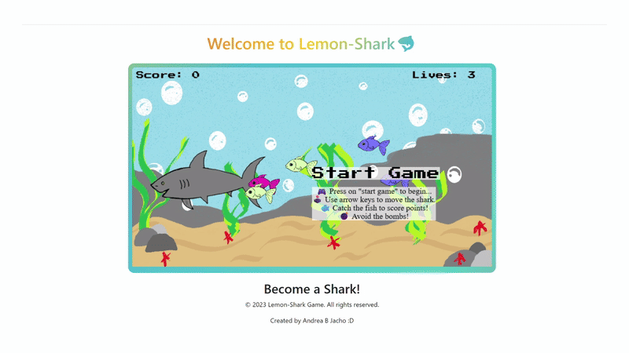

# 🍋 Lemon-Shark

**Lemon sharks 🦈 from the Caribbean** is a fun, fast-paced 2D browser game built with modern web technologies. Play as a hungry lemon shark and rack up points by eating fish—each fish is worth 10 points. But watch out: bombs drain your lives!

## 🎮 How to Play

- Press **"Start Game"** to begin.
- Use the **arrow keys** to move your shark around the sea.
- **Eat fish** to gain points.
- **Avoid bombs**—each bomb will take away a life!

## 🛠️ Technologies Used

- **JavaScript** — Core game logic and interactivity
- **Phaser** — Powerful HTML5 game framework for 2D games
- **HTML5 Canvas** — For dynamic, smooth rendering of graphics
- **CSS3** — Responsive layout and simple styles

## 🚀 Features

- Classic arcade gameplay: eat to score, avoid hazards!
- Intuitive keyboard controls (arrow keys)
- Dynamic scoring system
- Lives and game-over mechanics
- Custom-drawn pixel/canvas art (by me)
- Simple, colorful graphics

## 📦 Getting Started

1. Clone or download this repository.
2. Open `index.html` in your browser.
3. Enjoy the game!

## 👨‍🎨 Credits

- **Game Design & Art:** Ajacho
- **Framework:** [Phaser](https://phaser.io/)
- **All artwork is original.**

## 💡 Notes

- This is a hobby project. Feedback, stars, and suggestions are welcome!
- **Skill level:** Questionable but enthusiastic.

---

Have fun, and may your shark reign over the Caribbean!